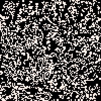

# Another Game of Life

This is a short implementation of [Conway's game of life](https://en.wikipedia.org/wiki/Conway%27s_Game_of_Life), made 
as an evening kata to practice domain-driven design, test-driven-design and clean architecture.




## Installation
```
pip install git+https://github.com/nickdelgrosso/another-game-of-life
``` 


## Run

Once the game's installed, it should be runnable directly from the terminal with the **agol** command.

```
agol
```


## Controls:

  - Space to restart
  - Escape to quit
  - Alt-Enter to go Fullscreen
  - Alt-3 to save gif of past 30-seconds of gameplay to desktop

## ToDo:

  - Add command-line options to the game to change initial parameters
  - Make vertical slices in the App and Rendering code to make Renderer a Plugin.
  - Auto-Detect classical GoL shapes during the game.
  - Add an ascii-renderer to run the game in the terminal.
  
  